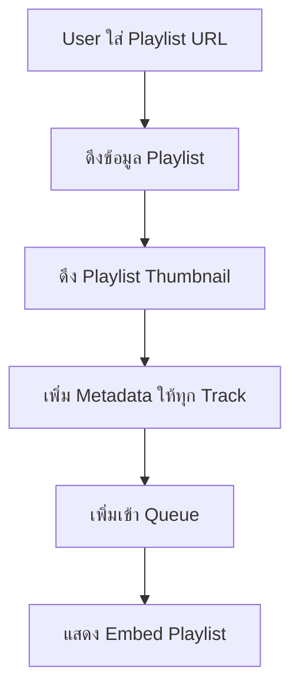
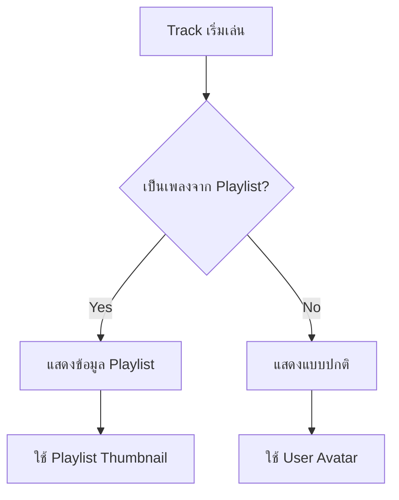

# Playlist Metadata System

ระบบจัดการข้อมูล playlist ที่ช่วยให้เพลงจาก playlist มีข้อมูลครบถ้วนและแสดงผลได้อย่างสวยงาม

## 🎯 ฟีเจอร์หลัก

- ✅ เก็บชื่อ playlist ใน track metadata
- ✅ เก็บ URL ของ playlist
- ✅ เก็บ thumbnail ของ playlist
- ✅ ติดตาม index ของเพลงใน playlist
- ✅ แสดงข้อมูล playlist ใน embed

## 📋 Interface

```typescript
export interface PlaylistMetadata {
    playlistName?: string;        // ชื่อ playlist
    playlistUrl?: string;         // URL ของ playlist
    playlistThumbnail?: string;   // Thumbnail URL
    isFromPlaylist?: boolean;     // เป็นเพลงจาก playlist หรือไม่
    playlistIndex?: number;       // ลำดับของเพลงใน playlist (1-based)
    playlistTotalTracks?: number; // จำนวนเพลงทั้งหมดใน playlist
}
```

## 🔧 ฟังก์ชันหลัก

### 1. เพิ่ม Playlist Metadata
```typescript
const tracksWithMetadata = addPlaylistMetadata(
    tracks,              // Array ของ tracks
    playlistName,        // ชื่อ playlist
    playlistUrl,         // URL ของ playlist
    thumbnailUrl         // Thumbnail URL (optional)
);
```

### 2. ตรวจสอบว่าเป็นเพลงจาก Playlist
```typescript
if (isFromPlaylist(track)) {
    // เป็นเพลงจาก playlist
}
```

### 3. ดึงข้อมูล Playlist
```typescript
const metadata = getPlaylistMetadata(track);
if (metadata) {
    console.log(metadata.playlistName);
    console.log(metadata.playlistIndex);
}
```

### 4. ดึง Playlist Thumbnail
```typescript
const thumbnail = getPlaylistThumbnail(track);
```

### 5. ดึง Playlist URL
```typescript
const url = getPlaylistUrl(track);
```

### 6. Format ข้อมูลสำหรับแสดงผล
```typescript
const info = formatPlaylistInfo(track, 'short');
// ผลลัพธ์: "จาก: My Playlist"

const indexInfo = formatPlaylistInfo(track, 'index-only');
// ผลลัพธ์: "(5/20)"
```

## 🎨 การแสดงผลใน Discord

### ในคำสั่ง `/play` (Playlist)
```
> 📝 Playlist: My Favorite Songs
> ⌛ เวลา: 1 ชั่วโมง 30 นาที
> 📊 มี: 20 เพลง
> คิวทั้งหมด: 25 เพลง
```

### ใน `trackStart` Event
```
▶️┃**Song Title** 3:45
> จาก: My Favorite Songs (5/20)
```

### ใน `/skipplay` (Playlist)
```
> ⏭️ Skipped ไปยัง My Favorite Songs โดย @User
> ⌛ เวลา: 1 ชั่วโมง 30 นาที
> 📊 มี: 20 เพลง
> คิวทั้งหมด: 25 เพลง
```

## 🔄 การทำงานของระบบ

### 1. เมื่อเล่น Playlist (/play)


### 2. เมื่อเพลงเริ่มเล่น (trackStart)


## 📝 ตัวอย่างการใช้งาน

### ในไฟล์ Command
```typescript
// play.ts
if (result.loadType === 'playlist') {
    // ดึง playlist thumbnail
    const thumbnailUrl = await getPlaylistThumbnailMain(query);
    
    // เพิ่ม metadata ให้ tracks
    const tracksWithMetadata = addPlaylistMetadata(
        result.tracks,
        result.playlistInfo.name,
        query,
        thumbnailUrl
    );
    
    // เพิ่มเข้า queue
    tracksWithMetadata.forEach(track => {
        player.queue.add(track);
    });
}
```

### ในไฟล์ Event
```typescript
// trackStart.ts
if (isFromPlaylist(track)) {
    const playlistInfo = formatPlaylistInfo(track, 'short');
    description += `\n> ${playlistInfo}`;
    
    // ใช้ playlist thumbnail เป็น iconURL
    const thumbnail = getPlaylistThumbnail(track);
    if (thumbnail) {
        iconURL = thumbnail;
    }
}
```

## 🎯 Format Options

### `formatPlaylistInfo(track, format)`

**Formats รองรับ:**

1. **`'short'`** - แสดงแค่ชื่อ playlist
   ```
   จาก: My Playlist
   ```

2. **`'full'`** - แสดงชื่อ + index
   ```
   จาก: My Playlist (5/20)
   ```

3. **`'index-only'`** - แสดงแค่ index
   ```
   (5/20)
   ```

## 🔍 Debugging

### ตรวจสอบ Metadata
```typescript
console.log('Track metadata:', {
    title: track.info.title,
    isFromPlaylist: isFromPlaylist(track),
    playlistName: getPlaylistMetadata(track)?.playlistName,
    playlistIndex: getPlaylistMetadata(track)?.playlistIndex,
    totalTracks: getPlaylistMetadata(track)?.playlistTotalTracks
});
```

### ตรวจสอบ Playlist Thumbnail
```typescript
const thumbnail = getPlaylistThumbnail(track);
console.log('Playlist thumbnail:', thumbnail || 'ไม่มี thumbnail');
```

## 🚨 Common Issues

### 1. ข้อมูล Playlist ไม่แสดง
- ตรวจสอบว่าเรียก `addPlaylistMetadata()` แล้วหรือไม่
- ตรวจสอบว่า `loadType === 'playlist'`

### 2. Thumbnail ไม่แสดง
- ตรวจสอบ network connection
- ตรวจสอบ YouTube API quota
- ดู fallback ใน icon configuration

### 3. Index ผิด
- Index เริ่มจาก 1 ไม่ใช่ 0
- ตรวจสอบ `playlistTotalTracks` ว่าถูกต้อง

## 🔗 Related Files

- `src/functions/lavalink/playlistMetadata.ts` - ฟังก์ชันหลัก
- `src/commands/lavalink/play.ts` - การใช้งานใน play command
- `src/commands/lavalink/skipplay.ts` - การใช้งานใน skipplay command
- `src/events/lavalink/trackStart.ts` - การแสดงผลเมื่อเพลงเริ่ม
