# 📄 Software Project Proposal: Narze V5 — Hybrid Music Bot & Web Dashboard

> วิชา Software Engineering  
> โดย: ผู้พัฒนาโปรเจกต์ Narze V5

---

## 1. บทสรุปผู้บริหาร (Executive Summary)

**Narze V5** คือระบบเล่นเพลงแบบ Hybrid ที่ผสมผสานระหว่าง **Discord Bot** กับ **Web Dashboard** ให้ผู้ใช้สามารถค้นหา สั่งเล่น จัดการคิวเพลง และควบคุมการเล่นเพลงได้ทั้งจากคำสั่ง Slash Command บน Discord และผ่านหน้าเว็บไซต์ Dashboard ที่ออกแบบ UI มาอย่างสวยงามทันสมัย

ระบบมีจุดเด่นที่การ **ซิงก์ข้อมูลแบบ Real-Time** ผ่าน Server-Sent Events (SSE) ทำให้ไม่ว่าจะสั่งงานจากช่องทางไหน หน้าจอทุกฝั่งจะอัปเดตพร้อมกันทันที รองรับแหล่งเพลงหลากหลาย ได้แก่ YouTube, Spotify และ SoundCloud โดยใช้ Lavalink เป็น Audio Engine กลาง

นอกจากนี้ยังมีระบบ **Admin Panel** ที่ให้ผู้ดูแลระบบสามารถดู System Stats, Logs แบบ Real-Time, ประวัติการใช้งาน, จัดการเซิร์ฟเวอร์ และดูประวัติแชทใน Discord ได้โดยไม่ต้อง SSH เข้าเซิร์ฟเวอร์

---

## 2. ที่มาและความสำคัญของปัญหา (Background and Rationale)

### ปัญหาที่พบในปัจจุบัน

ปัจจุบัน Discord เป็นแพลตฟอร์มหลักที่ชุมชนเกมเมอร์และกลุ่มเพื่อนใช้สื่อสาร และหนึ่งในกิจกรรมยอดนิยมคือการเปิดเพลงฟังร่วมกันในห้อง Voice Channel อย่างไรก็ตาม:

1. **Music Bot ฟรีส่วนใหญ่ถูกปิดตัว** — เช่น Groovy, Rythm ถูก Google/YouTube สั่งปิดให้บริการ เหลือเพียง Bot แบบเสียเงินที่มีข้อจำกัดด้านฟีเจอร์
2. **Bot ที่มีอยู่ไม่มี Web Dashboard** — ผู้ใช้ต้องพิมพ์คำสั่งทั้งหมดผ่านแชท ทำให้ประสบการณ์การใช้งานไม่ดีเท่าที่ควร ไม่สามารถค้นหาเพลง ดูหน้าปกอัลบั้ม หรือจัดการคิวเพลงแบบ Drag & Drop ได้
3. **ไม่มีระบบ Real-Time Sync** — หากสั่งเปลี่ยนเพลงจาก Discord หน้าเว็บจะไม่อัปเดตตาม ต้องรีเฟรชหน้าจอเอง
4. **ไม่มีระบบจัดการแบบ Admin** — ผู้ดูแลเซิร์ฟเวอร์ไม่สามารถดูสถิติ ประวัติการเล่น หรือจัดการบอทผ่านหน้าเว็บได้

### ความสำคัญ

การพัฒนา **Narze V5** จะช่วยแก้ปัญหาทั้งหมดข้างต้นโดยสร้าง Bot ที่ Self-hosted ได้เอง มี Dashboard ที่ทันสมัย และมีระบบ Real-Time Sync ที่ทำให้ทุกการเปลี่ยนแปลงถูกส่งถึงทุกหน้าจอทันที

---

## 3. วัตถุประสงค์ของโครงการ (Objectives)

1. พัฒนา Discord Music Bot ที่สามารถเล่นเพลงจาก YouTube, Spotify และ SoundCloud ได้
2. พัฒนา Web Dashboard ที่ผู้ใช้สามารถค้นหา สั่งเล่น และจัดการคิวเพลงผ่าน GUI ที่สวยงาม
3. สร้างระบบ **Real-Time Synchronization** ด้วย Server-Sent Events (SSE) ให้ทุกหน้าจออัปเดตพร้อมกัน
4. สร้างระบบ **Authentication** ด้วย Discord OAuth2 + Firebase Auth เพื่อจำกัดสิทธิ์การใช้งาน
5. สร้างระบบ **Admin Panel** สำหรับผู้ดูแลระบบ ประกอบด้วย System Monitoring, Real-Time Logs, ประวัติการเล่น และ Chat History
6. รองรับการ Self-host บน VPS ส่วนตัวได้อย่างเสถียร

---

## 4. ขอบเขตของโครงการ (Scope of Work)

### 4.1 ขอบเขตด้านระบบ (System Scope)

**สิ่งที่ระบบทำได้:**
- ค้นหาและเล่นเพลงจาก YouTube, Spotify, SoundCloud ผ่านทั้ง Discord Slash Command และ Web Dashboard
- จัดการคิวเพลง: เพิ่ม, ลบ, สลับลำดับ (Drag & Drop), ล้างคิว, สุ่มคิว (Shuffle)
- ควบคุมการเล่น: Play, Pause, Skip, Seek, Volume, Loop (Track/Queue)
- นำเข้า Playlist จาก Spotify และ YouTube
- บันทึกและแสดงประวัติการเล่นเพลง
- แสดง Voice Channel Members แบบ Real-Time
- ระบบ 24/7 Mode ให้บอทอยู่ในห้องตลอด
- Admin Panel: System Stats, Real-Time Logs, Chat History, User Sessions

**สิ่งที่ระบบไม่ได้ทำ:**
- ไม่สามารถสตรีมเพลงโดยตรงจาก Spotify (ใช้ YouTube เป็น Audio Source ผ่าน LavaSrc)
- ไม่มีระบบการชำระเงินหรือ Subscription

### 4.2 ขอบเขตด้านผู้ใช้งาน (User Scope)

| บทบาท | สิทธิ์การใช้งาน |
|---|---|
| **User ทั่วไป** | ค้นหาเพลง, สั่งเล่น, จัดการคิว (ต้องอยู่ห้อง Voice เดียวกับบอท), ดู Dashboard |
| **Server Owner** | ตั้งค่า Music Channel, จัดการ Guild Settings |
| **Admin** | เข้าถึง Admin Panel, ดู System Stats, Logs, Chat History, สั่ง Restart/Shutdown |
| **Developer** | สิทธิ์ทั้งหมดของ Admin + จัดการระบบระดับสูง |

### 4.3 ขอบเขตด้านเวลา (Timeline)

โครงการพัฒนาตั้งแต่เวอร์ชัน V1 จนถึง V5 ปัจจุบัน โดย V5 เป็นการ Rewrite ใหม่ทั้งหมดด้วย TypeScript และเพิ่ม Web Dashboard

---

## 5. การทบทวนงานที่เกี่ยวข้อง (Related Work)

| ระบบ | ข้อดี | ข้อจำกัด |
|---|---|---|
| **Groovy Bot** (ปิดตัว) | ใช้งานง่าย, รองรับ YouTube | ถูก YouTube สั่งปิด, ไม่มี Dashboard |
| **Rythm Bot** (ปิดตัว) | ยอดนิยม, คิวเพลงดี | ถูก YouTube สั่งปิด, ไม่มี Web UI |
| **Hydra Bot** | ยังให้บริการ, มี Dashboard เบื้องต้น | ฟีเจอร์จำกัดสำหรับ Free Plan, ไม่ Real-Time |
| **Jockiemusic** | รองรับหลาย Source | ไม่มี Dashboard, มีโฆษณา |
| **Narze V5 (โครงการนี้)** | Self-hosted, Dashboard ครบ, Real-Time SSE, Admin Panel | ต้อง Host เอง |

**จุดเด่นของ Narze V5 เทียบกับงานที่เกี่ยวข้อง:** เป็นระบบแรกที่ผสมผสาน Discord Bot + Next.js Dashboard + Real-Time SSE + Admin Panel + Firebase Auth ไว้ในโปรเจกต์เดียว

---

## 6. การวิเคราะห์ความต้องการระบบ (System Requirements)

### 6.1 Functional Requirements

| ID | ความต้องการ | รายละเอียด |
|---|---|---|
| FR-01 | ค้นหาเพลง | ค้นหาจาก Spotify API / YouTube ผ่าน Dashboard หรือ Discord |
| FR-02 | เล่นเพลง | สั่ง Play/Pause/Skip/Seek/Volume ผ่านทั้ง 2 ช่องทาง |
| FR-03 | จัดการคิวเพลง | เพิ่ม, ลบ, สลับลำดับ, ล้างคิว, สุ่มคิว |
| FR-04 | นำเข้า Playlist | ดึง Playlist จาก Spotify/YouTube URL มาเล่น |
| FR-05 | Login ด้วย Discord | ใช้ Discord OAuth2 + Firebase Custom Token |
| FR-06 | Real-Time Sync | ทุกการเปลี่ยนแปลงถูกส่งผ่าน SSE ทันที |
| FR-07 | ตั้งค่า Guild | กำหนด Music Channel, สิทธิ์ User |
| FR-08 | Admin Panel | ดู Stats, Logs, Chat History, User Sessions |
| FR-09 | บันทึกประวัติ | เก็บประวัติเพลงลง MongoDB + Firebase |
| FR-10 | 24/7 Mode | บอทอยู่ในห้อง Voice ตลอด 24 ชม. |

### 6.2 Non-Functional Requirements

| ID | ความต้องการ | รายละเอียด |
|---|---|---|
| NFR-01 | ประสิทธิภาพ | SSE ต้องส่งข้อมูลภายใน < 500ms |
| NFR-02 | ความเสถียร | ระบบ Reconnect อัตโนมัติเมื่อ Lavalink ล่ม |
| NFR-03 | ความปลอดภัย | จำกัดสิทธิ์ Admin ด้วย Discord ID, API Middleware |
| NFR-04 | ความสามารถในการขยาย | รองรับหลาย Guild พร้อมกัน |
| NFR-05 | ความเข้ากันได้ | รองรับ Browser หลัก (Chrome, Firefox, Edge) |
| NFR-06 | ความสะดวกในการ Deploy | ใช้ Docker หรือ pm2 บน VPS ได้ |

---

## 7. การออกแบบระบบ (System Design)

### 7.1 สถาปัตยกรรมระบบ (System Architecture)

ระบบแบ่งเป็น **2 ส่วนหลัก** ที่ทำงานร่วมกัน:

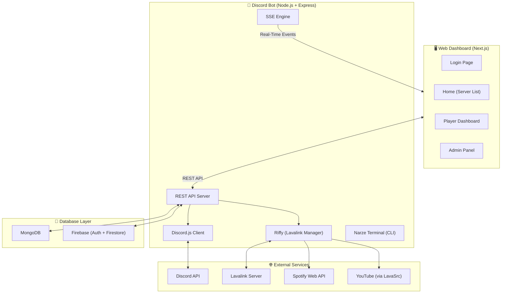

**ภาพรวมการทำงาน:** Dashboard สั่งงาน → Bot ไปเรียก Discord / Lavalink → Bot ส่งอัปเดตกลับมาที่ Dashboard แบบ Real-Time ผ่าน SSE

### 7.2 เครื่องมือและเทคโนโลยีที่ใช้ (Technology Stack)

| ส่วน | เทคโนโลยี |
|---|---|
| **Frontend** | Next.js 14 (React), TypeScript, Tailwind CSS, Shadcn UI |
| **State Management** | Zustand |
| **Backend** | Node.js, TypeScript, Express.js |
| **Discord Library** | discord.js v14 |
| **Audio Engine** | Lavalink 4 + Riffy (Lavalink Client) |
| **Music Sources** | LavaSrc Plugin (Spotify, YouTube, SoundCloud) |
| **Database** | MongoDB (Mongoose ODM) |
| **Authentication** | Discord OAuth2 + Firebase Auth (Custom Token) |
| **Real-Time** | Server-Sent Events (SSE) |
| **Cloud Services** | Firebase Firestore (Playlists, User Data) |

---

## 8. วิธีดำเนินโครงการ (Methodology)

### 8.1 กรอบกระบวนการพัฒนาระบบ (Software Process Framework)

โครงการใช้กรอบการพัฒนาแบบ **Agile — Iterative Development** โดยแบ่งการพัฒนาเป็นรอบ (Iteration) ตามฟีเจอร์หลัก:

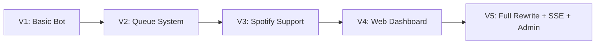

### 8.2 ขั้นตอนดำเนินงาน

1. **Analysis (วิเคราะห์):** ศึกษาความต้องการของผู้ใช้ใน Discord Community, วิเคราะห์จุดอ่อนของ Music Bot ที่มีอยู่
2. **Design (ออกแบบ):** ออกแบบ System Architecture, Database Schema, API Endpoints, UI/UX ของ Dashboard
3. **Implementation (พัฒนา):** พัฒนาทั้ง Backend (Bot + API) และ Frontend (Dashboard) พร้อมกัน ใช้ TypeScript ทั้งสองฝั่ง
4. **Testing (ทดสอบ):** ทดสอบการเล่นเพลง, SSE Sync, Queue Management, Auth Flow กับผู้ใช้จริงในเซิร์ฟเวอร์ Discord
5. **Deployment (ติดตั้ง):** Deploy บน VPS (Ubuntu) ใช้ pm2 สำหรับ Process Management

---

## 9. แผนการดำเนินงาน (Project Plan)

| ระยะ | ระยะเวลา | งานหลัก |
|---|---|---|
| **Phase 1** | สัปดาห์ 1-2 | วางแผน Architecture, ออกแบบ Database Schema, Setup Project |
| **Phase 2** | สัปดาห์ 3-5 | พัฒนา Bot Core: เล่นเพลง, คิว, Lavalink Integration |
| **Phase 3** | สัปดาห์ 6-8 | พัฒนา REST API + SSE Engine |
| **Phase 4** | สัปดาห์ 9-12 | พัฒนา Web Dashboard (Login, Player UI, Queue UI) |
| **Phase 5** | สัปดาห์ 13-15 | พัฒนา Admin Panel + Search System + Playlist Import |
| **Phase 6** | สัปดาห์ 16-17 | Testing, Bug Fixing, Performance Optimization |
| **Phase 7** | สัปดาห์ 18 | Deployment + Documentation |

---

## 10. ตัวอย่างผลการพัฒนา / Prototype (Prototype Demonstration)

### 10.1 Data Flow: การสั่งเล่นเพลงผ่าน Dashboard

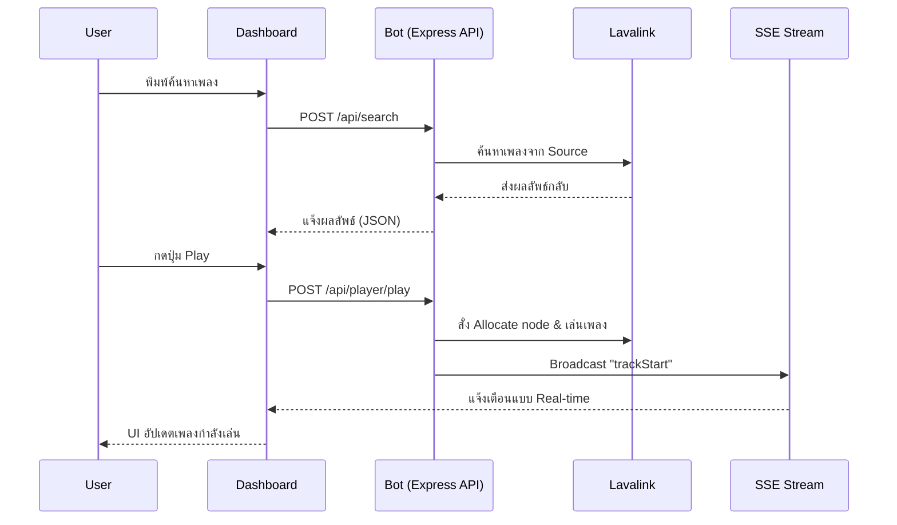

### 10.2 ระบบ Real-Time (Server-Sent Events)

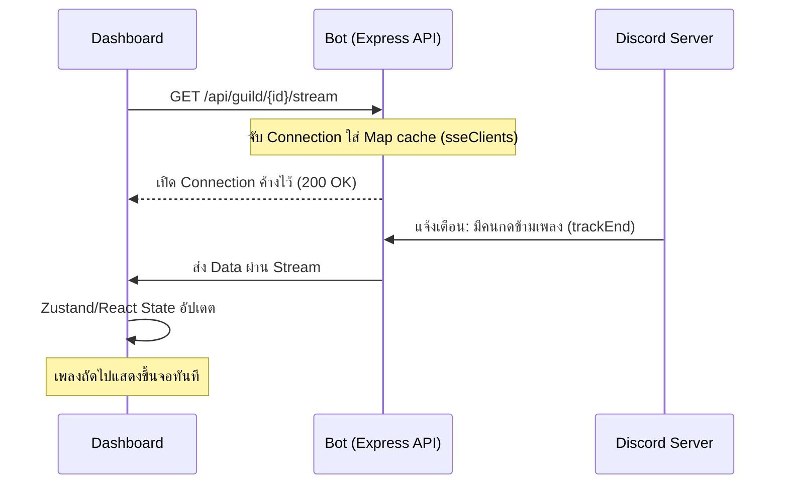

### 10.3 การจัดการคิวและซิงก์ข้อมูล (Queue Revision System)

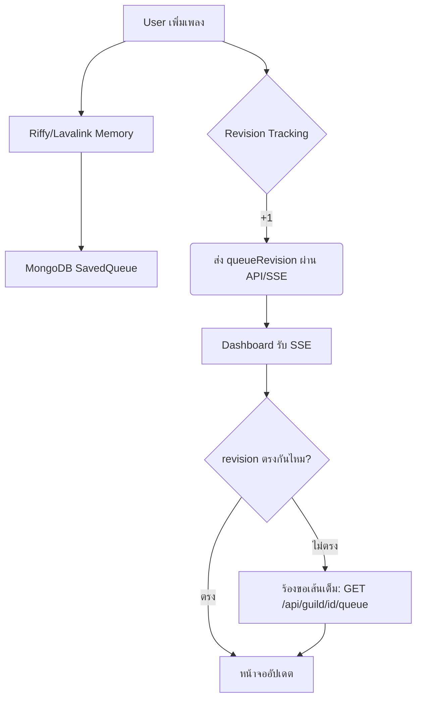

### 10.4 Bot Status & Auto-Reconnect System

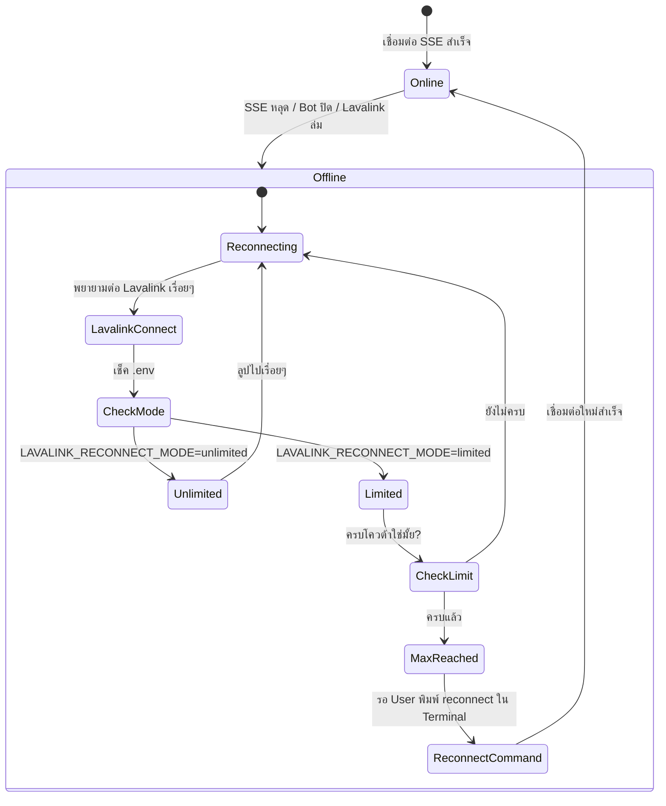

### 10.5 ระบบ Search & Music Providers

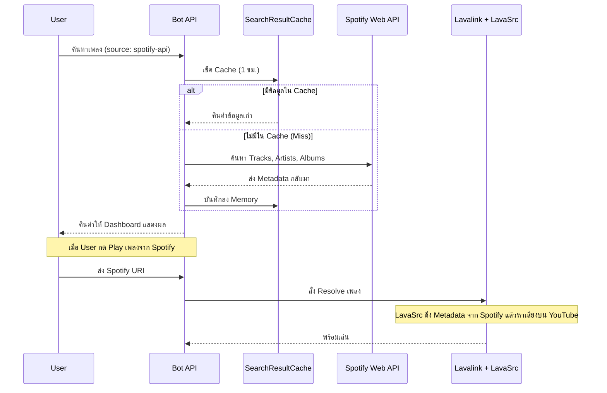

### 10.6 Admin Panel & History Tracking

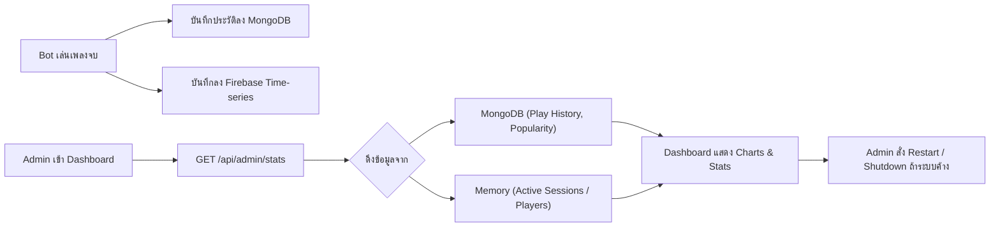

### 10.7 Discord OAuth2 + Firebase Auth Login

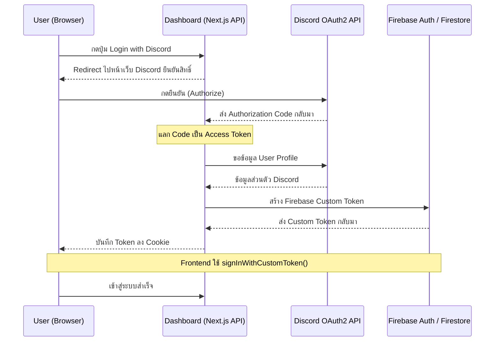

### 10.8 Voice State Permission System (Real-Time)

ระบบจัดการสิทธิ์ผู้ใช้แบบอัตโนมัติ เมื่อ User เข้า/ออกห้อง Voice Channel ระบบจะเช็คสิทธิ์และส่ง SSE แจ้ง Dashboard ทันที

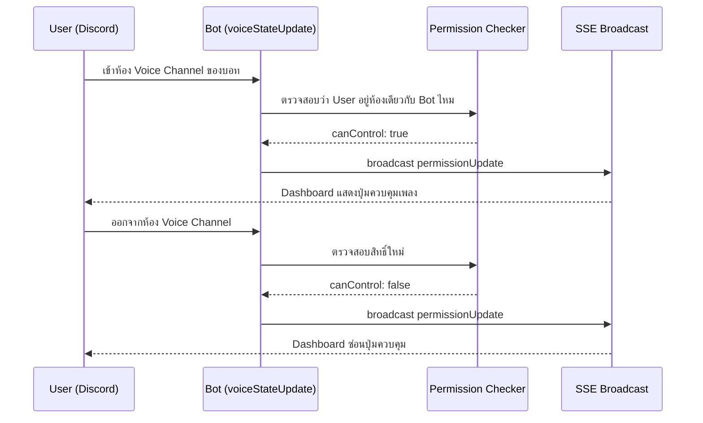

### 10.9 Admin Panel: Real-Time Terminal Logs

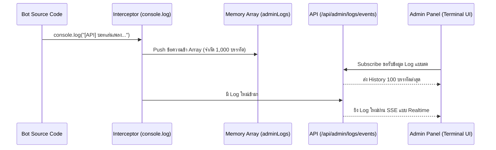

### 10.10 ระบบจำกัดสิทธิ์ Role Admin & Developer

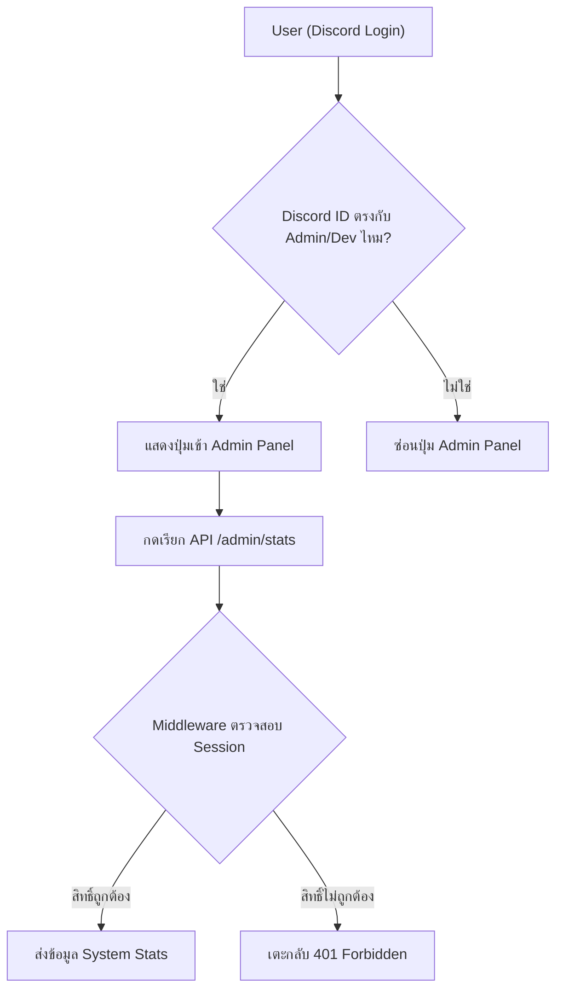

---

## 11. งบประมาณ (Budget Plan)

| รายการ | ค่าใช้จ่าย/เดือน | หมายเหตุ |
|---|---|---|
| VPS (Oracle Cloud / DigitalOcean) | 0 - 300 บาท | ใช้ Free Tier หรือ Droplet ราคาถูก |
| Domain Name (narze.space) | ~400 บาท/ปี | ซื้อโดเมน |
| MongoDB Atlas | ฟรี | ใช้ Free Tier (512 MB) |
| Firebase | ฟรี | ใช้ Spark Plan |
| Spotify API | ฟรี | Developer Account |
| **รวมต่อเดือน** | **~0 - 300 บาท** | |

---

## 12. การทดสอบและประเมินผล (Testing and Evaluation)

### Unit Testing
- ทดสอบระบบค้นหาเพลง (Search API) ว่าคืนค่าถูกต้อง
- ทดสอบระบบ Queue Management (Add, Remove, Move, Clear, Shuffle)
- ทดสอบระบบ Permission Checker (canUserControlBot)
- ทดสอบระบบ Cache (Hit/Miss)

### Integration Testing
- ทดสอบ Flow สั่งเล่นเพลง: Dashboard → API → Lavalink → SSE → Dashboard
- ทดสอบ Flow Login: Discord OAuth2 → Firebase Custom Token → Cookie
- ทดสอบ SSE Synchronization: เปิด Dashboard 2+ หน้าต่าง ตรวจสอบว่าซิงก์กัน
- ทดสอบ Reconnect: ปิด Lavalink แล้วเปิดใหม่ ตรวจสอบว่าบอทเชื่อมต่อกลับได้

### User Acceptance Testing (UAT)
- ให้ผู้ใช้จริงในเซิร์ฟเวอร์ Discord ทดลองใช้งานทุกฟีเจอร์
- เก็บ Feedback เรื่อง UI/UX, ความเร็ว, ความเสถียร
- ทดสอบกับหลาย Guild พร้อมกัน

---

## 13. เกณฑ์การประเมินผลสำเร็จของโครงการ (Project Success Criteria)

| เกณฑ์ | ตัวชี้วัด |
|---|---|
| ระบบเล่นเพลงได้ | เล่นเพลงจาก YouTube, Spotify ได้สำเร็จ ≥ 95% |
| Real-Time ทำงาน | SSE ส่งข้อมูลภายใน < 500ms |
| หลาย Discord Guild | รองรับ ≥ 5 Guild พร้อมกันโดยไม่ล่ม |
| Auth ปลอดภัย | Login ผ่าน Discord OAuth2 ได้ 100% |
| Admin Panel ทำงาน | แสดง Stats, Logs, Chat History ถูกต้อง |
| Bot เสถียร | Uptime ≥ 99% (บน VPS) |
| UI/UX ดี | ผู้ทดสอบให้คะแนนความพึงพอใจ ≥ 4/5 |

---

## 14. ผลประโยชน์ที่คาดว่าจะได้รับ (Expected Benefits)

1. **ผู้ใช้ Discord** ได้ Music Bot ที่มี Dashboard ทันสมัย ใช้งานง่ายเหมือน Spotify
2. **ผู้ดูแลเซิร์ฟเวอร์** มีเครื่องมือจัดการบอทผ่านเว็บ ไม่ต้อง SSH
3. **นักพัฒนา** ได้เรียนรู้การสร้างระบบ Full-Stack ที่ซับซ้อน รวมถึง Real-Time Architecture
4. **วงการ Open Source** ได้ต้นแบบ Self-hosted Music Bot ที่มี Web Dashboard สมบูรณ์

---

## 15. อื่นๆ (Other Details)

### โครงสร้างโฟลเดอร์หลัก

```
narze-v5/
├── bot/                    # Discord Bot (Backend)
│   ├── src/
│   │   ├── api/            # Express server + SSE
│   │   ├── commands/       # Slash Commands (/play, /skip, ...)
│   │   ├── events/         # Discord & Lavalink events
│   │   ├── functions/      # Core logic (lavalink, terminal, ...)
│   │   ├── models/         # MongoDB Schemas
│   │   └── lib/            # Utilities (Firebase, Logger, ...)
│   └── lavalink/           # Lavalink server config
├── dashboard/              # Web Dashboard (Frontend)
│   ├── app/                # Next.js App Router pages
│   ├── components/         # UI Components (Shadcn UI)
│   ├── hooks/              # React Hooks (useSSE, useBotStatus)
│   └── lib/                # Zustand stores, helpers
└── paper.md                # เอกสารนี้
```

### API Endpoints สำคัญ

| Method | Endpoint | หน้าที่ |
|---|---|---|
| POST | `/api/search` | ค้นหาเพลง |
| POST | `/api/player/play` | สั่งเล่นเพลง |
| GET | `/api/guild/:id/stream` | SSE Connection (Guild-level) |
| GET | `/api/user/:id/events` | SSE Connection (User-level) |
| GET | `/api/guild/:id/queue` | ดึงข้อมูลคิว |
| POST | `/api/queue/:id/move` | สลับลำดับคิว |
| POST | `/api/queue/:id/remove/:index` | ลบเพลงออกจากคิว |
| POST | `/api/queue/:id/clear` | ล้างคิว |
| GET | `/api/admin/stats` | ดึง System Stats |
| GET | `/api/admin/logs/events` | SSE: Real-Time Logs |

---

## 16. บรรณานุกรม (References)

1. Discord.js Documentation — https://discord.js.org/
2. Lavalink (Audio Server) — https://github.com/lavalink-devs/Lavalink
3. Riffy (Lavalink Client) — https://github.com/riffy-team/riffy
4. LavaSrc Plugin — https://github.com/topis-de/LavaSrc
5. Next.js Documentation — https://nextjs.org/docs
6. Tailwind CSS — https://tailwindcss.com/
7. Shadcn UI — https://ui.shadcn.com/
8. Zustand (State Management) — https://github.com/pmndrs/zustand
9. Firebase Documentation — https://firebase.google.com/docs
10. MongoDB Documentation — https://www.mongodb.com/docs/
11. Server-Sent Events (MDN) — https://developer.mozilla.org/en-US/docs/Web/API/Server-sent_events
12. Spotify Web API — https://developer.spotify.com/documentation/web-api
13. Discord OAuth2 — https://discord.com/developers/docs/topics/oauth2

---

## 17. ประวัติและผลงานอ้างอิงของผู้เสนอโครงการ (Team Profile)

*(กรุณากรอกข้อมูลส่วนตัวของผู้จัดทำ)*

| รายการ | ข้อมูล |
|---|---|
| ชื่อ-นามสกุล | — |
| รหัสนักศึกษา | — |
| สาขาวิชา | — |
| อาจารย์ที่ปรึกษา | — |
| ผลงานที่เกี่ยวข้อง | Narze V1-V4 (VersionHistory), Discord Bot Development |
