# 🚀 System Architecture & Data Flow: Narze v5

โปรเจกต์นี้แบ่งออกเป็น **2 ส่วนหลัก** ที่ทำงานร่วมกันอย่างใกล้ชิด คือ **Discord Bot (Backend)** และ **Web Dashboard (Frontend)**

ภาพรวมคือ: **Dashboard สั่งงาน ➡ Bot ไปเรียก Discord / Lavalink ➡ Bot ส่งอัปเดตกลับมาที่ Dashboard แบบ Real-Time ผ่าน SSE**

---

## 🏗️ 1. โครงสร้างหลักของระบบ (Architecture)

### 🤖 ฝั่ง Bot (Backend)
- **Engine:** Node.js + TypeScript
- **Discord Lib:** `discord.js` (จัดการ event และคำสั่งใน Discord)
- **Audio/Music:** `riffy` (Lavalink wrapper) ทำหน้าที่สื่อสารกับ Lavalink Server เพื่อเล่นเพลง (รองรับ YouTube, Spotify, SoundCloud ฯลฯ)
- **API Server:** `express` เป็น REST API ให้ Dashboard เรียกใช้คำสั่งต่างๆ (Play, Pause, Skip, Volume)
- **Real-Time API:** `SSE (Server-Sent Events)` ใช้ส่งข้อมูลกลับไปหน้าเว็บทันทีเมื่อมีอะไรเปลี่ยนแปลง (เช่น เพลงเปลี่ยน, คิวเปลี่ยน)
- **Database:** `MongoDB` (เก็บคิวเพลง, ประวัติการเล่น, ข้อมูล metadata ของเพลง)
- **Firebase:** บันทึกประวัติการใช้แบบ Time-series
- **Spotify API:** ใช้ดึงรูป Album Art และค้นหาเพลง

### 💻 ฝั่ง Dashboard (Frontend)
- **Framework:** Next.js (React) + TypeScript
- **Styling:** Tailwind CSS + Shadcn UI (Component library)
- **State Management:** `Zustand` (เก็บ Global State เช่น สถานะ Bot Online/Offline)
- **Auth:** Firebase Auth (Login ด้วย Google / Discord)
- **Real-Time Client:** ใช้ `EventSource` (hook: `useSSE`, `useUserSSE`) เพื่อรับข้อมูลสดๆ จาก Bot
- **API Communication:** เรียก API ไปที่ฝั่ง Bot โดยตรง

---

## 🔄 2. Data Flow (การไหลของข้อมูลและการทำงาน)

### 📌 Flow 1: การสั่งเล่นเพลงผ่าน Dashboard

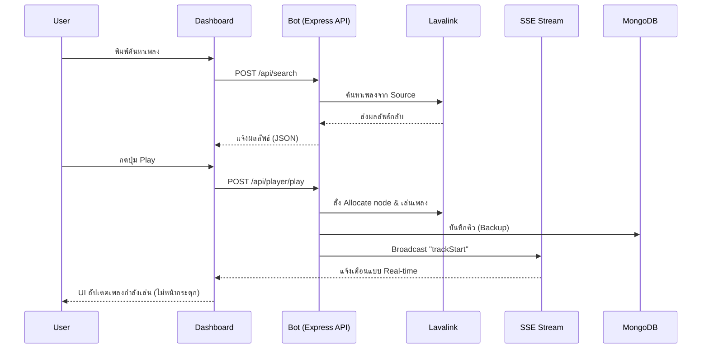

### 📌 Flow 2: ระบบ Real-Time (Server-Sent Events - SSE)

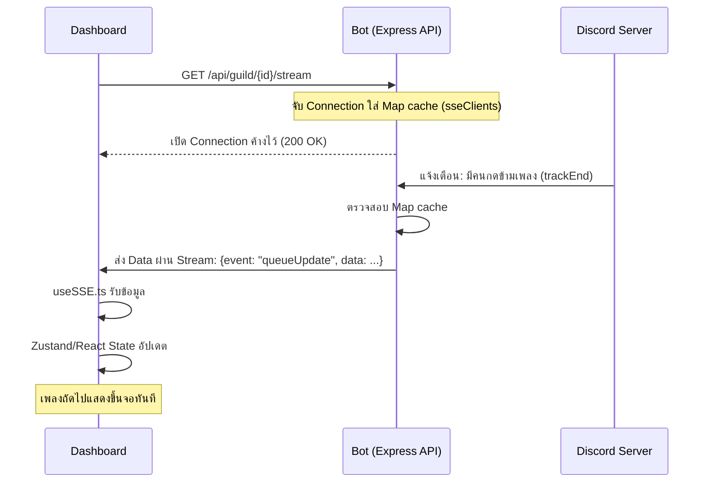

### 📌 Flow 3: การจัดการคิวและซิงก์ข้อมูล (Queue System)

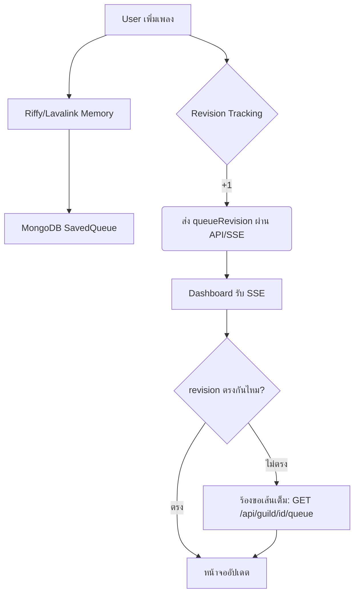

### 📌 Flow 4: การทำงานของ Bot Status & Error Handling (Reconnect)

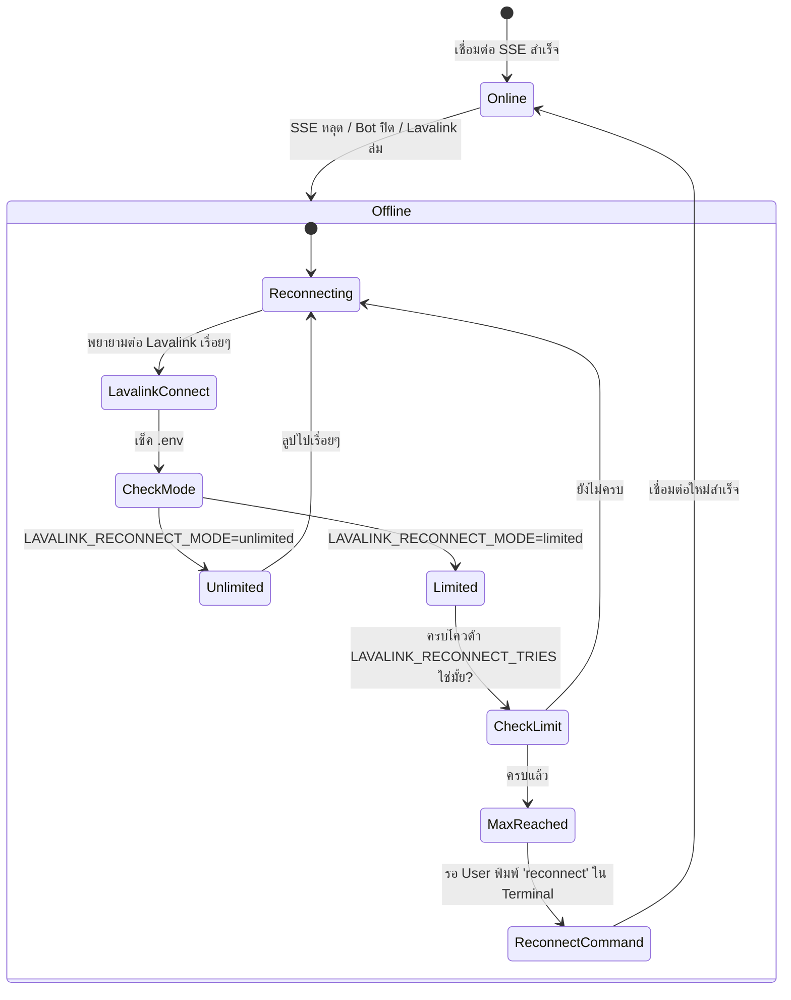

### 📌 Flow 5: ระบบ 🔍 Search & Music Providers (Spotify, YouTube, SoundCloud)

ระบบค้นหาของ Narze V5 มีความซับซ้อนเพราะทำงานแบบผสมผสาน (Hybrid) โดยรวมผลลัพธ์จากหลาย API เพื่อให้ประสบการณ์เทียบเท่า Music Streaming App

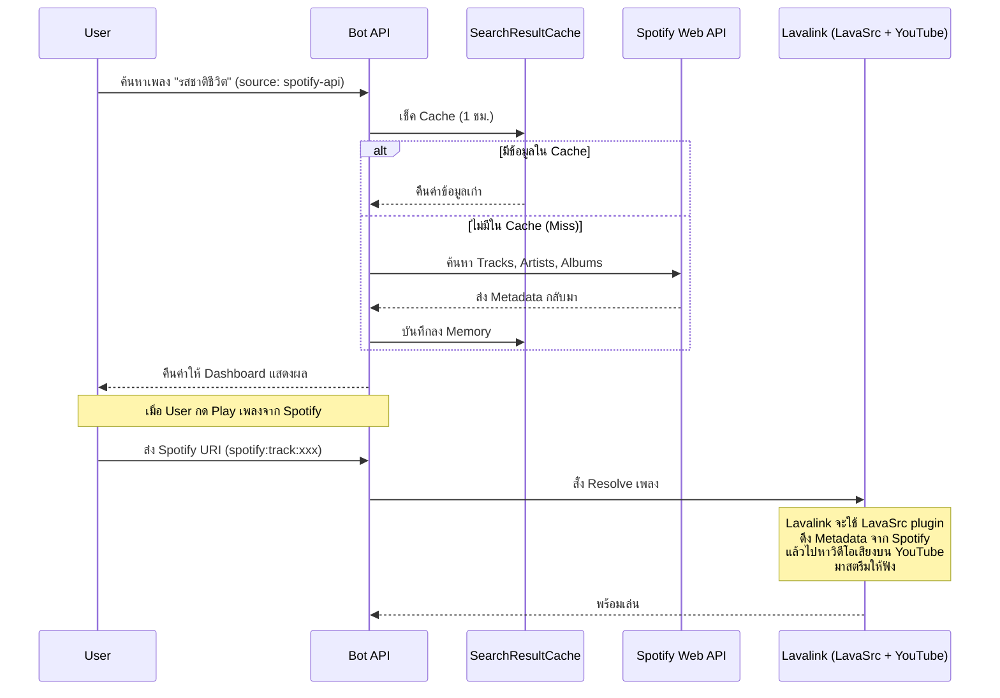

### 📌 Flow 6: ระบบ Admin Panel & History Tracking

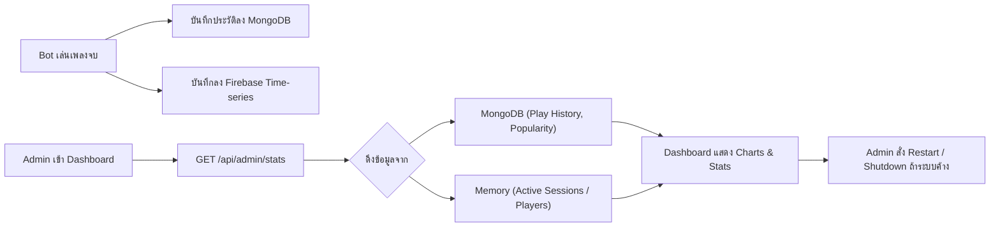

### 📌 Flow 7: 💻 Narze Terminal (CLI)

บอทมีหน้าต่าง Console ให้ Admin คุมผ่าน Server โดยตรง ไม่ต้องผ่าน Discord หรือ Web

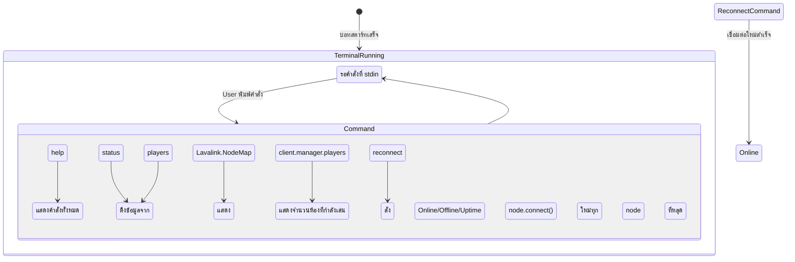

### 📌 Flow 8: ระบบ 💬 ดูประวัติแชท (Chat History) ผ่าน Admin Panel

ระบบนี้ไม่ได้ดักฟังและเก็บข้อความลง Database (เพื่อความเป็นส่วนตัวและประหยัดพื้นที่) แต่ใช้วิธี **ดึงข้อมูลสด (On-demand)** จาก Discord เมื่อ Admin ร้องขอผ่าน Dashboard

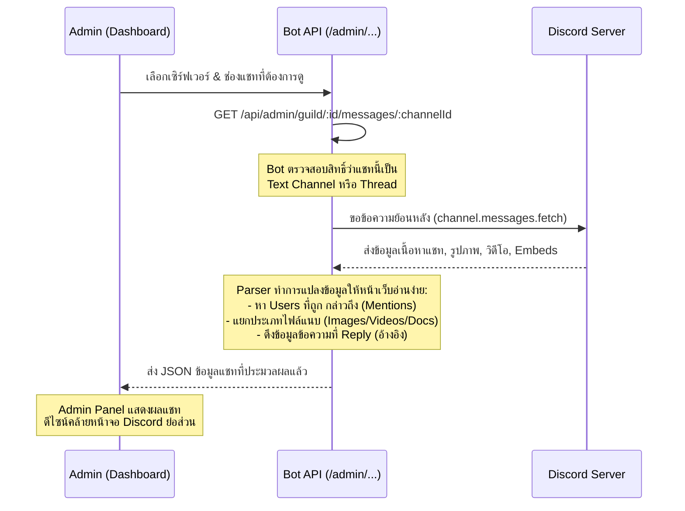

### 📌 Flow 9: ระบบ 🟢 อัปเดตสถานะบอทในหน้าเลือก Server (User SSE / Dashboard Presence)

เมื่อ User ล็อกอินหน้า Dashboard แล้วอยู่ในหน้า Home (หน้าเลือก Server) ระบบจะแสดง "จำนวนคิวปัจจุบัน" และ "สถานะกำลังเล่น" ของเซิร์ฟเวอร์ที่ User คนนั้นๆ อยู่แบบ **Realtime** ทันที ไม่ต้องกด Refresh

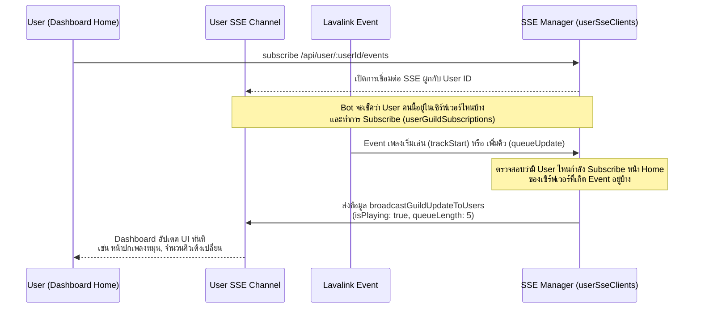

### 📌 Flow 10: ระบบ 🔀 จัดการคิว (Queue Management)

ระบบอำนวยความสะดวกในการจัดคิว เช่น สลับคิว, ลบคิว, ล้างคิว, สุ่มคิว (Shuffle) ผ่านหน้า Dashboard แบบลื่นไหลด้วย SSE
- **สลับลำดับ (Reorder/Move):** User ลากเพลงบนเว็บ (Drag & Drop) -> ส่งข้อมูลต้นทางปลายทางไปที่ `/api/queue/:id/move` -> Bot ย้ายข้อมูลใน Array `player.queue` -> ส่ง SSE แจ้งทุกคนในห้อง
- **ลบเพลง (Remove):** กดยกเลิกเพลง -> ไปที่ `/api/queue/:id/remove/:index` -> `player.queue.splice(index, 1)` -> ยิง SSE แจ้งอัปเดต
- **ล้างคิว (Clear):** `/api/queue/:id/clear` -> ลบ Array คิวทั้งหมดทิ้ง -> ยิง SSE
- **สุ่มคิว (Shuffle):** สุ่มสลับ Index ใน Array -> ยิง SSE

ทุกคำสั่งจะส่งผลให้ `player.queue` บน Lavalink Client ถูกแก้ไขทันทีแบบชั่วคราว (Memory) และยิง Event `queueUpdate` ให้ซิงก์กลับไปยังทุกหน้าจอ

### 📌 Flow 11: ระบบ 🎶 นำเข้าและโหลด Playlist (Spotify, YouTube)

Narze V5 สามารถค้นหา URL Playlist ของ Spotify หรือ YouTube และดึงมาเก็บไว้เปิดฟังส่วนตัวได้แบบฉับไว
1. **Fetch:** Dashboard ยิง URL Playlist มาที่ `/api/playlist/fetch`
2. **Resolve:** Lavalink Manager ใช้ "LavaSrc" (ปลั๊กอินพิเศษ) เพื่อแยกเพลงใน Playlist ออกมา หากเป็น Spotify จะไปดึงประวัติและหน้าปกจาก Spotify Web API เพิ่มเติม
3. **Save:** เมื่อกดบันทึก ข้อมูล Playlist จะถูกเก็บลงในเซิร์ฟเวอร์ฐานข้อมูล **Firebase Firestore** เพื่อให้เป็นบัญชีส่วนตัว
4. **Load:** เมื่อกดเล่น Playlist ระบบจะแปลงข้อมูล Track เป็น Array ยิงเข้า `/api/queue/:id/add-playlist` เพื่อเติมเพลงเข้าคิว Bot โดยเร็วที่สุดและเล่นทันที

### 📌 Flow 12: ระบบ ⚙️ ตั้งค่าห้องแชทสำหรับส่งการแจ้งเตือน (Notifications)

สามารถกำหนดให้ Bot ตอบสนองหรือปักหมุดตัวเองอยู่ใน Text Channel เดียวได้ เพื่อความสะอาดของ Server (ลดสแปมคำสั่ง)
- **Flow:** Admin หรือ เจ้าของเซิร์ฟเวอร์เปลี่ยนหมวดหมู่ช่องแชทบนโหมดตั้งค่า -> API เซฟข้อมูลลง **MongoDB** คอลเลกชัน `guild_settings`
- จากนั้น Bot จะยิง SSE ส่ง Event คลาส `settingsUpdate` กลับมา ทำให้ทุกคนในห้องเห็นการเปลี่ยนแปลงของ Text Channel ทันที (หากมีการเล่นเพลง Bot จะไม่ไปสร้าง Embed รบกวนห้องแชทอื่นๆ อีก)

### 📌 Flow 13: ระบบ 📊 แสดงสถานะ Server สด ใน Admin Panel

หน้าตักของผู้ดูแลระบบที่ดึงข้อมูลประมวลผลเซิร์ฟเวอร์ด้วยความเร็วระดับ Hardware-level (OS)
- **ดึงข้อมูล (Stats):** `/api/admin/stats` โดย Bot ขอข้อมูล `os.cpus()`, `os.totalmem()`, และขนาดของ Cache Directory แบบสดๆ 
- **ระบบ SSE พิเศษ (Logging & User Status):**
  - Bot แอบดักการทำงานของฟังก์ชันยอดฮิต (`console.log`, `console.warn`) ทั้งหมด แล้วเก็บเข้าคิว Buffer ส่งผ่าน SSE `/api/admin/logs/events` ทะลุหน้าเว็บให้ Admin ดูทันที ไม่ต้อง SSH เข้าเซิร์ฟเวอร์
  - คอยตรวจสอบ User Active Sessions ที่กำลังเชื่อมต่อ และรายงานตรงขึ้นไปให้ Admin เห็น (Presence) ผ่านระบบ ListeningSessionManager

### 📌 Flow 14: ระบบ 👑 จำกัดสิทธิ์ Role Admin & Developer

ระบบความปลอดภัยป้องกันไม่ให้ User ทั่วไปสั่งการระบบหลัก หรือ Restart บอทได้
1. **Check Role:** ตรวจสอบรหัส Discord ID ภายใน Config Environment ([.env](file:///c:/Github/narze%20v5%20beta/narze%20v5.0.2/bot/.env) ของฝั่ง Dashboard / API)
2. **Gateway:** เมนู "จัดการเซิร์ฟเวอร์ (Admin Panel)" จะเรนเดอร์ให้เฉพาะ Discord ID ที่มีสิทธิ์ตามระบบเท่านั้น
3. **Backend Middleware:** ทุกๆ API Endpoint ของผู้ดูแลระบบ (เช่น `/restart` หรือ `/shutdown`) จะตรวจสอบ Discord Session (ว่าตรงกับ Token ที่เก็บสิทธิ์ Dev/Admin ไหม) หากฝืนยิง API จะถูกดักด้วย `401 Unauthorized` เสมอ

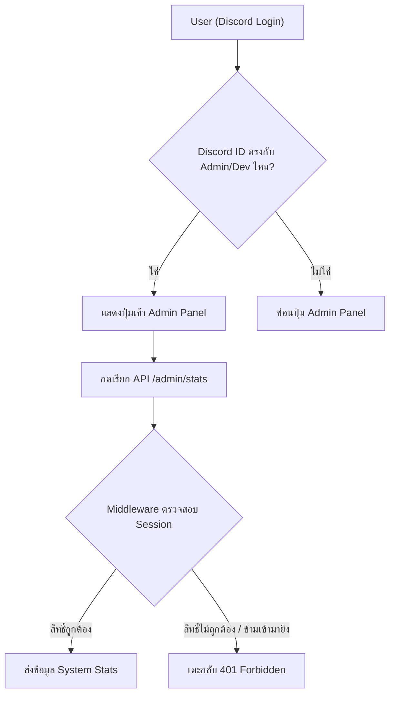

### 📌 Flow 15: ระบบ 🖥️ แสดง Terminal Bot ในหน้า Admin Panel

แทนที่จะต้องเปิด SSH เข้าไปดูหน้าจอบน Server โดยตรง Narze V5 ได้พัฒนาระบบที่จับข้อความ (Intercept) จากการทำงานของหลังบ้านมาวาดบนหน้าเว็บ Dashboard เสมือนหน้าจอ Terminal ของจริง

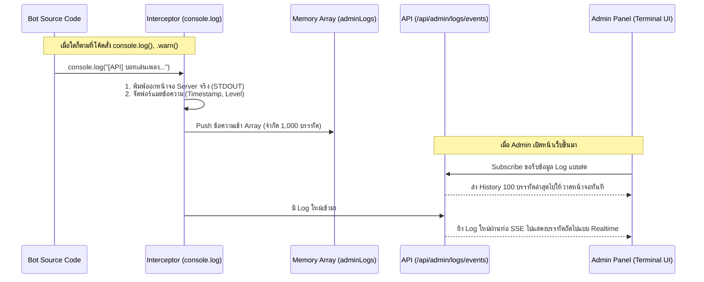

- **จุดเด่น:** สามารถดักจับสี (Color Formatter) และ Error Level ต่างๆ เพื่อสร้างกล่องข้อความที่มีโค้ดสีต่างกันบนหน้าเว็บได้ (เช่น แดง=Error, เหลือง=Warning) และประหยัดทรัพยากรเพราะไม่ได้เซฟลง Database

### 📌 Flow 16: ระบบ 🔑 Login ด้วย Discord (OAuth2 + Firebase Auth)

Narze V5 ใช้ระบบ **Discord OAuth2** เพื่อดึงข้อมูลเซิร์ฟเวอร์ที่ผู้ใช้อยู่ (Guilds) ร่วมกับ **Firebase Authentication** เพื่อจัดการ Session และสร้างฐานบัญชีผู้ใช้ (ใช้สถาปัตยกรรมแบบ Custom Token)

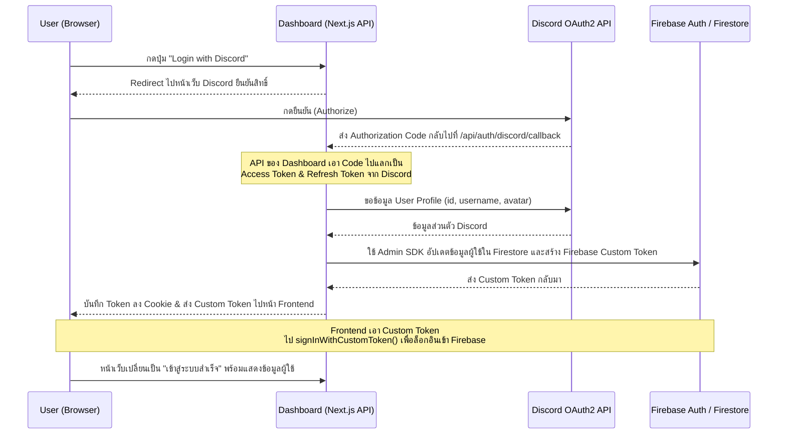

- **จุดเด่น:** 
  - การใช้ Firebase คู่กันทำให้ระบบไม่ต้องสร้าง Database เขียน Session Login เองแบบดั้งเดิม (JWT Custom) 
  - จัดการข้อมูล Firebase (เช่น Playlists หรือ ประวัติฟังเพลง) ผ่าน Firebase Client SDK บนฝั่ง Frontend ได้อย่างปลอดภัยทันที

### 📌 Flow 17: ระบบ 🎤 Voice State Permission (จัดการสิทธิ์อัตโนมัติตามห้อง Voice)

เมื่อ User เข้า/ออกห้อง Voice Channel ระบบจะตรวจสอบอัตโนมัติว่า User อยู่ห้องเดียวกับบอทหรือไม่ แล้วส่ง SSE แจ้ง Dashboard ทันทีเพื่ออัปเดตปุ่มควบคุม (แสดง/ซ่อน)

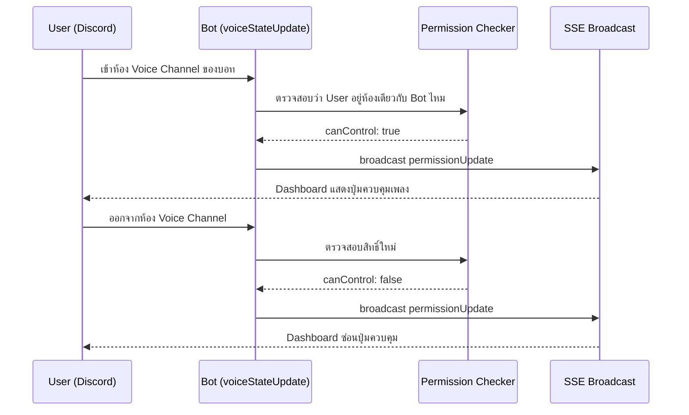

- **จุดเด่น:** ระบบยังรองรับกรณีที่บอทถูกย้ายห้อง (Bot Moving) โดยจะทำ Batch Permission Update ให้ User ทุกคนในทั้งห้องเก่าและห้องใหม่พร้อมกัน

---

## 📂 3. อธิบายโครงสร้างโฟลเดอร์แบบสรุป

### `/bot/src/` (ใจกลางสมอง Bot)
- **`index.ts`** : จุดเริ่มต้น โหลด config, โหลด Discord Client, สร้าง API Server, เริ่ม Terminal
- **`api/`** : Express server ที่หน้าเว็บยิงมาคุย มีระบบ SSE Stream และ routing
- **`commands/`** : คำสั่ง Slash Command ของ Discord (/play, /skip)
- **`events/`** : ตัวดักจับเวลามีอะไรเกิดขึ้น เช่น มีคนเข้าห้อง (`voiceStateUpdate`), Lavalink เล่นเพลงจบ (`trackEnd`)
- **`functions/`** : โค้ดรวมของระบบสำคัญๆ เช่น `lavalink/manager.ts`, `terminal.ts`
- **`models/`** : โครงสร้าง MongoDB (Mongoose Schema)
- **`lib/`** : Utils ต่างๆ เช่น Firebase, Custom Logger, Formatter

### `/dashboard/` (ฝั่งหน้าบ้าน)
- **`app/`** : โครงสร้างหน้าเว็บแบบ App Router ของ Next.js
- **`components/`** : ชิ้นส่วน UI (ปุ่ม, แถบ Queue, แถบเวลา, ช่องค้นหา) สร้างมาจาก Shadcn UI
- **`hooks/`** : React Hooks สำคัญมาก โดยเฉพาะ `useSSE.ts` (รับ stream จากบอท) และ `useBotStatus.ts`
- **`lib/`** : Zustand Stores (เก็บ State กลาง), Fetcher helpers

---

## 🏁 บทสรุป

**Narze V5** เป็นแอปเพลงที่ "Hybrid" คือสามารถพิมพ์ `/play` ลงใน Discord แชทก็ได้ หรือเปิดเว็บ **Dashboard** เข้าไปกดสั่งงานผ่าน GUI ล้ำๆ ก็ได้ โดยไม่ว่าจะสั่งจากทางไหน **หน้าจอเว็บก็จะอัปเดตและเคลื่อนไหวตามกันไปพร้อมๆ กันแบบเสี้ยววินาทีผ่านทางเทคโนโลยี SSE** ครับ
